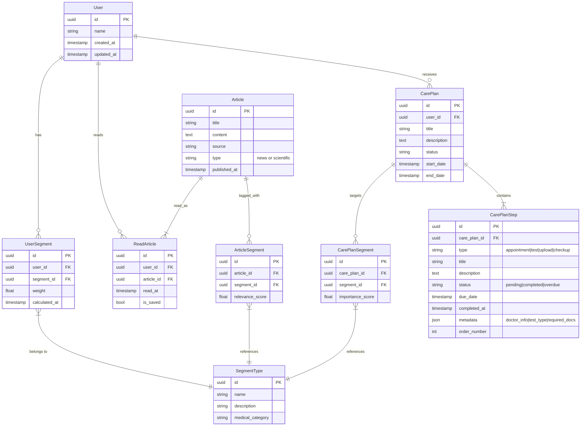

# Medical Care App Dashboard Query

## Application Overview
Healthcare app for users with chronic conditions (e.g., rare allergies):
- Manages treatment plans with reminders for checkups/appointments
- Delivers relevant medical research updates and healthcare events

## Dashboard Features
1. Treatment Timeline
    - Recent completed activities with outcomes
    - Upcoming scheduled tasks
2. Personalized Article Feed
    - Ranked by user health segment relevance
    - Article engagement tracking (unread/viewed/read/saved)

## Technical Challenge
Complexity: Medium

Performance bottlenecks:
- Dashboard endpoint experiencing RPS scaling issues
- Complex relational data model with multiple joins
- Real-time personalization requirements

## Database Structure

